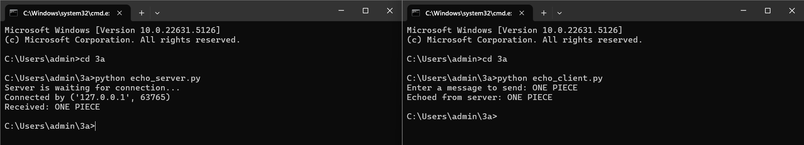

# 3a.CREATION FOR ECHO CLIENT AND ECHO SERVER USING TCP SOCKETS
# AIM
To write a python program for creating Echo Client and Echo Server using TCP
Sockets Links.
## ALGORITHM:
1. Import the necessary modules in python

2. Create a socket connection to using the socket module.

3. Send message to the client and receive the message from the client using the Socket module in server.

4. Send and receive the message using the send function in socket.

## PROGRAM
## SERVER
```
import socket
server_socket = socket.socket(socket.AF_INET, socket.SOCK_STREAM)
server_socket.bind(('localhost', 12345))
server_socket.listen(1)
print("Server is waiting for connection...")
conn, addr = server_socket.accept()
print("Connected by", addr)
while True:
    data = conn.recv(1024)
    if not data:
        break
    print("Received:", data.decode())
    conn.sendall(data)
conn.close()
```

## Client
```
import socket
client_socket = socket.socket(socket.AF_INET, socket.SOCK_STREAM)
client_socket.connect(('localhost', 12345))
message = input("Enter a message to send: ")
client_socket.sendall(message.encode())
data = client_socket.recv(1024)
print("Echoed from server:", data.decode())
client_socket.close()
```

## OUPUT

## RESULT
Thus, the python program for creating Echo Client and Echo Server using TCP Sockets Links 
was successfully created and executed.
